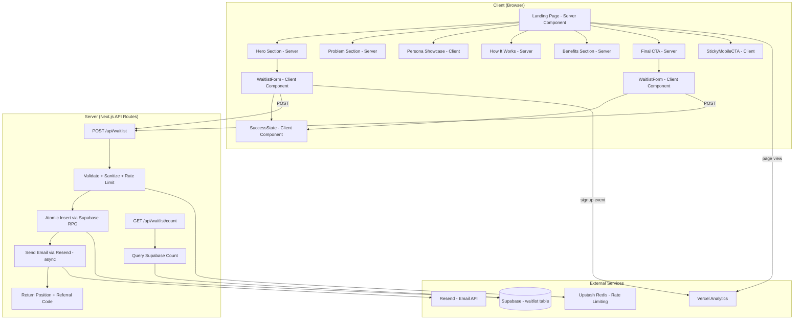
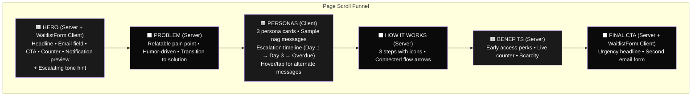

# Design Document

## Overview

A single-page waitlist landing page for The Nagging Partner, built with Next.js 15 (App Router), Tailwind CSS v4, and Supabase. The page follows a conversion-optimized scroll funnel: Hero → Problem → Personas → How It Works → Benefits → Final CTA. The architecture maximizes static rendering via Server Components, with client-side interactivity isolated to the email form, animations, and persona card interactions. Confirmation emails sent via Resend with React Email templates. Referral tracking via Supabase.

## Steering Document Alignment

### Technical Standards
- Next.js 15 with App Router and static generation (`export const revalidate = 60`)
- Tailwind CSS v4 (CSS-first config via `@theme` directive)
- TypeScript strict mode throughout
- Server Components by default; `"use client"` only for interactive islands

### Project Structure
- Next.js App Router conventions (`app/` directory)
- shadcn/ui for form primitives (Input, Button)
- Motion (Framer Motion) for animations
- Resend + React Email for transactional email

## Skills, Tools, and MCP Servers to Use

### Skills (by task phase)

| Phase | Skill | When to Use |
|-------|-------|-------------|
| **Initial page build** | `/frontend-design` | PRIMARY skill for all UI component creation. Forces distinctive typography, color, layout. Bans AI slop. Use when building hero, persona cards, how-it-works, CTA sections. |
| **After initial build** | `/polish` | Final pass on alignment, spacing, consistency, micro-details before shipping |
| **After initial build** | `/audit` | Run accessibility, performance, theming, and responsive checks. Generates scored report with P0-P3 issues. |
| **Typography** | `/typeset` | Use when setting up the font system (Space Grotesk + DM Sans). Fixes hierarchy, sizing, weight, readability. |
| **Animations** | `/animate` | Use when adding scroll animations, persona card hover effects, and form micro-interactions via Motion |
| **Color system** | `/colorize` | Use if the page feels too monochromatic. Adds strategic color while maintaining the accent-on-dark palette. |
| **Responsive** | `/adapt` | Use when implementing mobile/tablet/desktop breakpoints. Handles fluid layouts and touch targets. |
| **Copy/UX writing** | `/clarify` | Use for CTA copy, error messages, success states, and persona sample messages |
| **Visual impact** | `/bolder` | Use if the design feels too safe or generic. Amplifies visual interest. |
| **Production readiness** | `/harden` | Use for error handling, edge cases, and making the form robust |
| **Performance** | `/optimize` | Use after build to diagnose and fix loading speed, bundle size, image optimization |
| **Accessibility review** | `/web-design-guidelines` | Review against Vercel's 100+ accessibility/UX rules |
| **React patterns** | `/vercel-react-best-practices` | Apply Vercel's 57 React/Next.js performance rules during component development |

### MCP Servers

| Server | When to Use |
|--------|-------------|
| **Context7** (`mcp__context7__resolve-library-id` → `mcp__context7__query-docs`) | Use for ALL library lookups: Next.js 15 App Router patterns, Tailwind v4 `@theme` syntax, Supabase client setup, Resend API, Motion (Framer Motion) API, React Email components, shadcn/ui component usage, Upstash Redis rate limiting. Always prefer this over guessing API syntax. |
| **Playwright** | Use for E2E testing — signup flow, responsive checks, form validation, scroll behavior |

### Agent Types

| Agent | When to Use |
|-------|-------------|
| `spec-task-executor` | Execute each implementation task. Has access to all tools. |
| `Explore` | Search the codebase when looking for existing patterns, components, or utilities |
| `Plan` | If a task is complex and needs architectural breakdown before coding |

### Key Tool Usage Notes
- **Always use Context7** before writing code that uses Next.js, Tailwind v4, Supabase, Resend, or Motion APIs — docs may have changed
- **Use `/frontend-design` as the primary skill** for every visual component — it's Anthropic's official design skill and specifically bans generic AI aesthetics
- **Run `/audit` after completing all visual components** to catch accessibility and performance issues early
- **Run `/polish` as the final step** before considering the page done
- **Use `/vercel-react-best-practices`** when writing any React component to ensure optimal patterns

## Code Reuse Analysis

### Existing Components to Leverage
- **shadcn/ui Input + Button**: Base form components with built-in accessibility
- **Aceternity UI**: Cherry-pick animated components for hero visual flair (spotlight effect, animated gradient)
- **next/font**: Font loading with zero layout shift
- **next/image**: Optimized image delivery

### Integration Points
- **Supabase**: Waitlist table for email storage, referral tracking, position counting
- **Resend**: Confirmation email delivery via API route
- **Vercel Analytics**: Lightweight conversion tracking
- **Vercel**: Deployment with edge caching for static content

## Architecture



## Page Layout Diagram



## Components and Interfaces

### Page Component: `app/page.tsx`
- **Purpose:** Server Component that renders the full landing page layout
- **Interfaces:** Fetches initial waitlist count from Supabase at request time with `revalidate = 60`
- **Dependencies:** All section components, `lib/waitlist.ts`
- **Reuses:** Supabase client from `lib/supabase.ts`
- **URL Params:** Reads `searchParams.ref` to extract referral code, passes to WaitlistForm

### Component: `HeroSection`
- **Purpose:** Above-the-fold section with headline, subheadline, email form, social proof counter, persona notification preview, and escalating tone hint
- **Type:** Server Component (wraps WaitlistForm client component)
- **Props:** `{ waitlistCount: number, referralCode?: string }`
- **Dependencies:** WaitlistForm, NotificationPreview
- **Reuses:** shadcn/ui layout primitives
- **Escalating tone hint:** Displays a small badge or text like "Personas get meaner as your deadline approaches" near the notification preview

### Component: `ProblemSection`
- **Purpose:** Relatable pain point about manual nagging, framed with humor
- **Type:** Server Component wrapped in ScrollAnimationWrapper
- **Props:** None (static content)
- **Dependencies:** ScrollAnimationWrapper

### Component: `PersonaShowcase`
- **Purpose:** Displays 3 persona cards with sample nag messages and escalating tone timeline
- **Type:** Client Component (`"use client"` for hover/tap interactions)
- **Props:** None (imports from `data/personas.ts`)
- **Dependencies:** PersonaCard, ScrollAnimationWrapper
- **Reuses:** Persona data from `data/personas.ts`
- **Interactions:** Hover/tap reveals alternate message; escalation timeline (Day 1 → Day 3 → Overdue)
- **Layout:** 3 columns desktop, 2 columns tablet, 1 column stacked mobile

### Component: `PersonaCard`
- **Purpose:** Individual persona card with notification UI styling, escalation timeline
- **Type:** Client Component
- **Props:** `{ persona: Persona }` (see Data Models)
- **Dependencies:** Motion (for hover animations)
- **Accessibility:** `role="button"`, `aria-expanded` for alternate message state, `tabIndex={0}`, keyboard enter/space triggers tap interaction

### Component: `HowItWorks`
- **Purpose:** 3-step visual flow explaining the app
- **Type:** Server Component wrapped in ScrollAnimationWrapper
- **Props:** None (static content)
- **Dependencies:** ScrollAnimationWrapper
- **Layout:** Horizontal flow with connecting arrows (desktop), 2 columns (tablet), vertical stack (mobile)

### Component: `BenefitsSection`
- **Purpose:** Early access perks + social proof counter + scarcity messaging
- **Type:** Server Component
- **Props:** `{ waitlistCount: number }`
- **Dependencies:** ScrollAnimationWrapper

### Component: `FinalCTA`
- **Purpose:** Second email capture with urgency-driven copy ("Don't make us send Grandma after you")
- **Type:** Server Component (wraps WaitlistForm client component)
- **Props:** `{ waitlistCount: number, referralCode?: string }`
- **Dependencies:** WaitlistForm
- **Contains:** WaitlistForm with `variant="footer"`

### Component: `WaitlistForm`
- **Purpose:** Single email input + submit button + all form states
- **Type:** Client Component (`"use client"`)
- **Props:** `{ variant: "hero" | "footer", waitlistCount: number, referralCode?: string }`
- **States:**
  - `idle` — email input + "Get Early Access" button
  - `loading` — disabled input + spinner
  - `success` — SuccessState component (position + referral link + share buttons)
  - `error` — error message + retry, email preserved
  - `duplicate` — "Already on the list" + shows referral link
- **Validation:** Email format check on blur via regex, inline error with `aria-invalid` and `aria-describedby`
- **Action:** Calls `POST /api/waitlist` via fetch
- **Accessibility:**
  - `aria-live="polite"` region for status messages (success, error, duplicate)
  - `aria-invalid="true"` on input when validation fails
  - `aria-describedby` pointing to error message element
  - Focus moves to success state heading after successful signup
  - Focus moves to error message after failed submission

### Component: `SuccessState`
- **Purpose:** Post-signup display with position, referral link, share buttons
- **Type:** Client Component
- **Props:** `{ position: number, referralCode: string, referralUrl: string }`
- **Dependencies:** Analytics tracking for share clicks
- **Share buttons:** Twitter/X, WhatsApp, iMessage (sms: link), Copy Link
- **Pre-written message:** "I just joined the waitlist for an app that nags your partner as a Drunk Irish Guy. Get on the list: {referralUrl}"
- **Accessibility:** Heading receives focus on mount, share buttons have accessible labels

### Component: `StickyMobileCTA`
- **Purpose:** Fixed bottom bar on mobile after scrolling past hero
- **Type:** Client Component (IntersectionObserver on hero + footer CTA)
- **Props:** None
- **Behavior:** Appears after hero exits viewport, hides when footer CTA enters viewport
- **Reuses:** Scroll detection via IntersectionObserver (same approach as analytics scroll tracking)

### Component: `ScrollAnimationWrapper`
- **Purpose:** Reusable wrapper that applies scroll-triggered fade-up/slide-in animations via Motion
- **Type:** Client Component
- **Props:** `{ children: ReactNode, direction?: "up" | "left" | "right", delay?: number }`
- **Dependencies:** Motion (Framer Motion), `useReducedMotion` hook
- **Behavior:** Uses IntersectionObserver to trigger. Respects `prefers-reduced-motion` — renders children immediately without animation if motion is reduced

### Component: `GrainOverlay`
- **Purpose:** CSS-based noise/grain texture overlay for backgrounds
- **Type:** Server Component (pure CSS, no JS)
- **Implementation:** CSS `background-image` with inline SVG noise filter, `pointer-events: none`

### Component: `NotificationPreview`
- **Purpose:** Fake push notification mockup showing a sample persona nag message
- **Type:** Server Component (static content)
- **Props:** None (uses first persona from `data/personas.ts`)
- **Styling:** Styled to look like an iOS/Android push notification

### Component: `ScrollTracker`
- **Purpose:** Tracks scroll depth milestones for analytics
- **Type:** Client Component
- **Props:** None
- **Implementation:** IntersectionObserver on sentinel elements placed at 25%, 50%, 75%, 100% of page height
- **Fires:** `trackEvent('scroll_depth', { milestone: 25 | 50 | 75 | 100 })` via `lib/analytics.ts`

## Data Models

### Supabase Table: `waitlist`
```sql
CREATE TABLE waitlist (
  id UUID DEFAULT gen_random_uuid() PRIMARY KEY,
  email TEXT UNIQUE NOT NULL,
  referral_code TEXT UNIQUE NOT NULL,
  referred_by TEXT REFERENCES waitlist(referral_code),
  position INTEGER NOT NULL,
  referral_count INTEGER DEFAULT 0,
  created_at TIMESTAMPTZ DEFAULT now()
);

-- RLS: anonymous insert-only, no direct reads
ALTER TABLE waitlist ENABLE ROW LEVEL SECURITY;

CREATE POLICY "Allow anonymous inserts"
  ON waitlist FOR INSERT
  TO anon
  WITH CHECK (true);

-- No anonymous SELECT policy. All reads go through service role key in API routes.

-- Atomic signup function to prevent position race conditions
CREATE OR REPLACE FUNCTION signup_waitlist(
  p_email TEXT,
  p_referral_code TEXT,
  p_referred_by TEXT DEFAULT NULL
)
RETURNS TABLE(out_position INTEGER, out_referral_code TEXT, out_is_duplicate BOOLEAN)
LANGUAGE plpgsql
SECURITY DEFINER
AS $$
DECLARE
  v_position INTEGER;
  v_existing RECORD;
BEGIN
  -- Check for duplicate
  SELECT position, referral_code INTO v_existing
  FROM waitlist WHERE email = p_email;

  IF FOUND THEN
    RETURN QUERY SELECT v_existing.position, v_existing.referral_code, TRUE;
    RETURN;
  END IF;

  -- Atomic position assignment
  SELECT COALESCE(MAX(position), 0) + 1 INTO v_position FROM waitlist FOR UPDATE;

  INSERT INTO waitlist (email, referral_code, referred_by, position)
  VALUES (p_email, p_referral_code, p_referred_by, v_position);

  -- Update referrer count if applicable
  IF p_referred_by IS NOT NULL THEN
    UPDATE waitlist SET referral_count = referral_count + 1
    WHERE referral_code = p_referred_by;
  END IF;

  RETURN QUERY SELECT v_position, p_referral_code, FALSE;
END;
$$;

-- Indexes
CREATE INDEX idx_waitlist_referral_code ON waitlist(referral_code);
CREATE INDEX idx_waitlist_email ON waitlist(email);
```

### Persona Data Type
```typescript
// data/personas.ts
interface PersonaMessage {
  label: string;    // e.g., "Day 1", "Day 3", "Overdue"
  tone: "friendly" | "impatient" | "angry";
  text: string;     // The actual nag message
}

interface Persona {
  id: string;
  name: string;           // e.g., "Old Grandma"
  emoji: string;          // e.g., "👵"
  description: string;    // Short personality description
  messages: PersonaMessage[];  // Escalating messages (3 levels)
  altMessage: string;     // Alternate message shown on hover/tap
}
```

### API Request/Response Types
```typescript
// POST /api/waitlist
interface WaitlistRequest {
  email: string;
  referredBy?: string; // referral code from ?ref= param
}

interface WaitlistResponse {
  success: boolean;
  position?: number;
  referralCode?: string;
  referralUrl?: string;
  error?: string;
  isDuplicate?: boolean;
}

// GET /api/waitlist/count
interface WaitlistCountResponse {
  count: number;
}

// Confirmation email props
interface WaitlistEmailProps {
  position: number;
  referralCode: string;
  referralUrl: string;
}
```

### Analytics Event Types
```typescript
// lib/analytics.ts
type AnalyticsEvent =
  | { name: 'page_view' }
  | { name: 'scroll_depth'; properties: { milestone: 25 | 50 | 75 | 100 } }
  | { name: 'waitlist_signup'; properties: { referralSource?: string } }
  | { name: 'share_click'; properties: { platform: 'twitter' | 'whatsapp' | 'imessage' | 'copy_link' } }
  | { name: 'form_error'; properties: { type: 'validation' | 'duplicate' | 'server_error' | 'rate_limit' } };
```

### Referral Code Format
- 8-character alphanumeric string (e.g., `A7kX9mB2`)
- Generated server-side via `crypto.randomBytes(6).toString('base64url').slice(0, 8)`
- Not sequential, not guessable

### Referral Position Update Logic
- When a referred user signs up, the Supabase RPC function atomically increments the referrer's `referral_count`
- Effective position displayed to user = `original_position - referral_count` (minimum 1)
- Position shown at signup time is the `original_position`; the referral benefit is communicated as "Each friend who joins moves you up 1 spot"
- Note: Returning users cannot currently see their updated position (out of scope for landing page validation)

## API Routes

### `POST /api/waitlist`
1. Validate email format (server-side regex check)
2. Sanitize input (trim, lowercase)
3. Check rate limit via Upstash Redis (5 per IP per hour)
4. Generate referral code via `crypto.randomBytes`
5. Call Supabase RPC `signup_waitlist(email, referral_code, referred_by)` — handles position atomically + duplicate detection
6. If not duplicate, send confirmation email via Resend (async, non-blocking `Promise` — don't await)
7. Construct referral URL (using request origin + `?ref=` + code)
8. Return position + referral code + referral URL

### `GET /api/waitlist/count`
1. Query `SELECT count(*) FROM waitlist` using Supabase service role client
2. Return count with `Cache-Control: s-maxage=60, stale-while-revalidate=120`

## SEO and Metadata

### `app/layout.tsx` Metadata Configuration
```typescript
export const metadata: Metadata = {
  title: "The Nagging Partner — Let AI Nag Your People",
  description: "Assign tasks to your partner, roommate, or coworker. Pick a nagging persona. They get reminded until it's done. Join the waitlist.",
  metadataBase: new URL('https://naggingpartner.com'), // placeholder until domain is set
  openGraph: {
    title: "The Nagging Partner — Let AI Nag Your People",
    description: "Assign tasks. Pick a persona (Grandma, Drunk Irish Guy, Sergeant). They get nagged until it's done.",
    type: 'website',
    images: [{ url: '/og-image.png', width: 1200, height: 630, alt: 'The Nagging Partner' }],
  },
  twitter: {
    card: 'summary_large_image',
    title: "The Nagging Partner — Let AI Nag Your People",
    description: "Assign tasks. Pick a persona. They get nagged until it's done.",
    images: ['/og-image.png'],
  },
};
```

### OG Image
- Dimensions: 1200x630px
- Static image placed at `public/og-image.png`
- Shows: App name, tagline, persona emojis, brand colors
- Can be upgraded to dynamic OG image via `next/og` (ImageResponse) later

## Email Template

### Confirmation Email (React Email)
- **From:** noreply@[domain] (or Resend default sender `onboarding@resend.dev` until domain is set)
- **Subject:** "You're in. Here's your spot on The Nagging Partner waitlist."
- **Props:** `WaitlistEmailProps` (position, referralCode, referralUrl)
- **Body:**
  - Waitlist position badge
  - Referral link (plain text, clickable)
  - "What happens next" section (monthly updates, access code at launch)
  - Share CTA ("Tell your friends, move up the list")
  - Brand-consistent styling (Space Grotesk for headings, brand colors)

## Visual Design System

### Color Palette
```css
@theme {
  --color-background: #0a0a0a;        /* Near-black base */
  --color-surface: #141414;            /* Card/section backgrounds */
  --color-surface-hover: #1a1a1a;      /* Hover states */
  --color-accent: #FF6B35;             /* Saturated orange — energetic, fun */
  --color-accent-hover: #FF8255;       /* Lighter orange for hover */
  --color-text-primary: #FAFAFA;       /* White text */
  --color-text-secondary: #A1A1A1;     /* Muted gray */
  --color-text-accent: #FF6B35;        /* Orange highlights */
  --color-success: #22C55E;            /* Green for success states */
  --color-error: #EF4444;              /* Red for errors */
  --color-border: #262626;             /* Subtle borders */
}
```

**Contrast ratios verified:**
- `#FAFAFA` on `#0a0a0a` = 19.3:1 (AAA)
- `#FAFAFA` on `#141414` = 17.1:1 (AAA)
- `#A1A1A1` on `#0a0a0a` = 6.7:1 (AA)
- `#A1A1A1` on `#141414` = 6.1:1 (AA)
- `#FF6B35` on `#0a0a0a` = 4.6:1 (AA for large text only — use for headlines/buttons, not small body text)

### Typography
```css
@theme {
  --font-display: 'Space Grotesk', sans-serif;  /* Headlines */
  --font-body: 'DM Sans', sans-serif;           /* Body text */
}
```

| Element | Font | Weight | Size (mobile → desktop) |
|---------|------|--------|------------------------|
| Hero headline | Space Grotesk | 700 | 36px → 64px |
| Section headlines | Space Grotesk | 600 | 28px → 40px |
| Subheadlines | DM Sans | 500 | 18px → 22px |
| Body text | DM Sans | 400 | 16px → 18px |
| Button text | Space Grotesk | 600 | 16px → 18px |
| Small/caption | DM Sans | 400 | 14px |

### Spacing System
- Base unit: 4px
- Section padding: 80px vertical (desktop), 48px (mobile)
- Max content width: 1200px
- Card padding: 24px (mobile), 32px (desktop)

### Animation Specifications
| Animation | Trigger | Duration | Easing |
|-----------|---------|----------|--------|
| Section fade-up | Scroll into viewport | 600ms | ease-out |
| Persona card hover | Mouse enter | 200ms | ease-in-out |
| Notification preview | Page load + 1s delay | 500ms | spring(1, 80, 10) |
| Button press | Click/tap | 100ms | ease-in |
| Form state transition | State change | 300ms | ease-out |
| Success celebration | Signup success | 1000ms | ease-out |

All animations disabled when `prefers-reduced-motion: reduce` is active.

## File Structure

```
app/
├── layout.tsx                    # Root layout with fonts, metadata, Vercel Analytics
├── page.tsx                      # Main landing page (Server Component, revalidate=60)
├── globals.css                   # Tailwind v4 imports, @theme, grain overlay CSS
├── api/
│   └── waitlist/
│       ├── route.ts              # POST handler (signup via Supabase RPC)
│       └── count/
│           └── route.ts          # GET handler (waitlist count)
├── components/
���   ├── hero-section.tsx          # Hero with headline, form, notification preview
│   ├── problem-section.tsx       # Pain point section
│   ├── persona-showcase.tsx      # 3 persona cards container (client)
│   ├── persona-card.tsx          # Individual persona card (client)
│   ├── how-it-works.tsx          # 3-step flow
│   ├── benefits-section.tsx      # Early access perks + counter
│   ├── final-cta.tsx             # Bottom CTA section
│   ├── waitlist-form.tsx         # Email form + all states (client)
│   ├── success-state.tsx         # Position + referral + share (client)
│   ├── sticky-mobile-cta.tsx     # Fixed mobile bottom bar (client)
│   ├── scroll-animation.tsx      # Motion scroll wrapper (client)
│   ├── scroll-tracker.tsx        # Scroll depth analytics (client)
│   ├── grain-overlay.tsx         # CSS grain texture (server)
│   └── notification-preview.tsx  # Fake push notification UI (server)
├── lib/
│   ├── supabase.ts               # Supabase client init (anon + service role)
│   ├── waitlist.ts               # Waitlist operations (signup RPC, count query)
│   ├── referral.ts               # Referral code generation
│   ├── email.ts                  # Resend email sending
│   ├── rate-limit.ts             # Upstash Redis rate limiting
│   └── analytics.ts              # Event tracking helpers (Vercel Analytics wrapper)
├── emails/
│   └── waitlist-confirmation.tsx  # React Email template
├── data/
│   └── personas.ts               # Persona definitions (names, emojis, messages, escalations)
└── public/
    └── og-image.png              # Open Graph social preview image (1200x630)
```

## Error Handling

### Error Scenarios
1. **Invalid email format**
   - **Handling:** Client-side validation on blur + server-side re-validation
   - **User Impact:** Inline error message below input ("Please enter a valid email"), `aria-invalid="true"` on input

2. **Duplicate email submission**
   - **Handling:** Supabase RPC returns `is_duplicate = true` with existing referral code
   - **User Impact:** Friendly message "You're already on the list!" + show existing referral link

3. **Supabase unreachable**
   - **Handling:** Try/catch around RPC call, return error response
   - **User Impact:** "Something went wrong. Please try again." + email input preserved + focus on error message

4. **Resend email failure**
   - **Handling:** Async fire-and-forget with `console.error` logging
   - **User Impact:** None — signup succeeds, email is best-effort

5. **Rate limit exceeded**
   - **Handling:** Upstash Redis check returns 429 before hitting Supabase
   - **User Impact:** "Too many attempts. Please try again later."

6. **Waitlist count query failure**
   - **Handling:** Return fallback of 0, counter element hidden when count is 0
   - **User Impact:** Counter not displayed (no broken UI)

## Testing Strategy

### Unit Testing
- Email sanitization and format validation
- Referral code generation (length, character set, uniqueness over 1000 iterations)
- Rate limit logic (allows under threshold, blocks at threshold, resets after window)
- Analytics event helper produces correct payloads

### Integration Testing
- Full signup flow: POST → Supabase RPC → response with position + code
- Duplicate email returns existing referral code with `isDuplicate: true`
- Referral tracking: signup with `referredBy` param updates referrer's `referral_count`
- Rate limiting blocks after 5 requests from same IP
- Count endpoint returns correct number and caches

### End-to-End Testing (Playwright)
- Complete signup flow on desktop (1280px) and mobile (375px) viewports
- Form validation states (invalid email on blur, empty submit, duplicate)
- Persona card hover (desktop) and tap (mobile) interactions
- Scroll animations trigger correctly (or are absent with reduced motion)
- Sticky mobile CTA appears after scrolling past hero, disappears near footer CTA
- Share buttons generate correct URLs with referral code
- Success state displays position and referral link after signup
- Page Lighthouse performance score >= 90
- Keyboard-only navigation through all interactive elements
